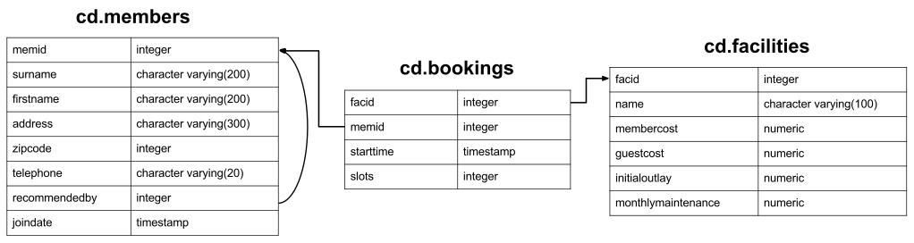

http://docs.peewee-orm.com/en/latest/peewee/query_examples.html



(1) Retrieve everything

Retrieve all information from facilities table.

```sql
SELECT * FROM facilities;
```

```python
# By default, when no fields are explicitly passed to select(), all fields
# will be selected.
query = Facility.select()
```

(2) Retrieve specific columns from a table

Retrieve names of facilities and cost to members.

```sql
SELECT name, membercost FROM facilities;
```

```python
query = Facility.select(Facility.name, Facility.membercost)

# To iterate:
for facility in query:
    print(facility.name)
```

(3) Control which rows are retrieved

Retrieve list of facilities that have a cost to members.

```sql
SELECT * FROM facilities WHERE membercost > 0;
```

```python
query = Facility.select().where(Facility.membercost > 0)
```

(4) Control which rows are retrieved - part 2

Retrieve list of facilities that have a cost to members, and that fee is less than 1/50th of the monthly maintenance cost. Return id, name, cost and monthly-maintenance.

```sql
SELECT facid, name, membercost, monthlymaintenance
FROM facilities
WHERE membercost > 0 AND membercost < (monthlymaintenance / 50);
```

```python
query = Facility
         .select(Facility.facid, Facility.name, Facility.membercost,Facility.monthlymaintenance)         
         .where((Facility.membercost > 0) & (Facility.membercost < (Facility.monthlymaintenance / 50)))             
```

(5) Basic string searches

How can you produce a list of all facilities with the word ‘Tennis’ in their name?

```sql
SELECT * FROM facilities WHERE name LIKE '%tennis%';
```

```python
query = Facility.select().where(Facility.name.contains('tennis'))

# OR use the exponent operator. Note: you must include wildcards here:
query = Facility.select().where(Facility.name ** '%tennis%')
```

(5) Matching against multiple possible values

How can you retrieve the details of facilities with ID 1 and 5? Try to do it without using the OR operator.

```sql
SELECT * FROM facilities WHERE facid IN (1, 5);
```

```python
query = Facility.select().where(Facility.facid.in_([1, 5]))

# OR:
query = Facility.select().where((Facility.facid == 1) | (Facility.facid == 5))                             
```

(6) Classify results into buckets

How can you produce a list of facilities, with each labelled as ‘cheap’ or ‘expensive’ depending on if their monthly maintenance cost is more than $100? Return the name and monthly maintenance of the facilities in question.

```sql
SELECT name,
CASE WHEN monthlymaintenance > 100 THEN 'expensive' ELSE 'cheap' END
FROM facilities;
```

```python
cost = Case(None, [(Facility.monthlymaintenance > 100, 'expensive')], 'cheap')
query = Facility.select(Facility.name, cost.alias('cost'))
```

(7) Working with dates

How can you produce a list of members who joined after the start of September 2012? Return the memid, surname, firstname, and joindate of the members in question.

```sql
SELECT memid, surname, firstname, joindate FROM members
WHERE joindate >= '2012-09-01';
```

```python
query = (Member
         .select(Member.memid, Member.surname, Member.firstname, Member.joindate)
         .where(Member.joindate >= datetime.date(2012, 9, 1)))
```

(8) Removing duplicates, and ordering results

How can you produce an ordered list of the first 10 surnames in the members table? The list must not contain duplicates.

```sql
SELECT DISTINCT surname FROM members ORDER BY surname LIMIT 10;
```

```python
query = (Member
         .select(Member.surname)
         .order_by(Member.surname)
         .limit(10)
         .distinct())
```

(9) Combining results from multiple queries

You, for some reason, want a combined list of all surnames and all facility names.

```sql
SELECT surname FROM members UNION SELECT name FROM facilities;
```

```python
lhs = Member.select(Member.surname)
rhs = Facility.select(Facility.name)
query = lhs | rhs
```
Queries can be composed using the following operators:

| - UNION
+ - UNION ALL
& - INTERSECT
- - EXCEPT

(10) Simple aggregation

You’d like to get the signup date of your last member. How can you retrieve this information?

```sql
SELECT MAX(join_date) FROM members;
```

```python
query = Member.select(fn.MAX(Member.joindate))
# To conveniently obtain a single scalar value, use "scalar()":
# max_join_date = query.scalar()
```

(11) More aggregation

You’d like to get the first and last name of the last member(s) who signed up - not just the date.

```sql
SELECT firstname, surname, joindate FROM members
WHERE joindate = (SELECT MAX(joindate) FROM members);
```

```python
# Use "alias()" to reference the same table multiple times in a query.
MemberAlias = Member.alias()
subq = MemberAlias.select(fn.MAX(MemberAlias.joindate))
query = (Member
         .select(Member.firstname, Member.surname, Member.joindate)
         .where(Member.joindate == subq))
```

(12) Retrieve the start times of members’ bookings

How can you produce a list of the start times for bookings by members named ‘David Farrell’?

```sql
SELECT starttime FROM bookings
INNER JOIN members ON (bookings.memid = members.memid)
WHERE surname = 'Farrell' AND firstname = 'David';
```

```python
query = (Booking
         .select(Booking.starttime)
         .join(Member)
         .where((Member.surname == 'Farrell') &
                (Member.firstname == 'David')))
```

(13) Work out the start times of bookings for tennis courts

How can you produce a list of the start times for bookings for tennis courts, for the date ‘2012-09-21’? Return a list of start time and facility name pairings, ordered by the time.

```sql
SELECT starttime, name
FROM bookings
INNER JOIN facilities ON (bookings.facid = facilities.facid)
WHERE date_trunc('day', starttime) = '2012-09-21':: date
  AND name LIKE 'tennis%'
ORDER BY starttime, name;
```

```python
query = (Booking
         .select(Booking.starttime, Facility.name)
         .join(Facility)
         .where(
             (fn.date_trunc('day', Booking.starttime) == datetime.date(2012, 9, 21)) &
             Facility.name.startswith('Tennis'))
         .order_by(Booking.starttime, Facility.name))

# To retrieve the joined facility's name when iterating:
for booking in query:
    print(booking.starttime, booking.facility.name)
```

(14) Produce a list of all members who have recommended another member

How can you output a list of all members who have recommended another member? Ensure that there are no duplicates in the list, and that results are ordered by (surname, firstname).

```sql
SELECT DISTINCT m.firstname, m.surname
FROM members AS m2
INNER JOIN members AS m ON (m.memid = m2.recommendedby)
ORDER BY m.surname, m.firstname;
```

```python
MA = Member.alias()
query = (Member
         .select(Member.firstname, Member.surname)
         .join(MA, on=(MA.recommendedby == Member.memid))
         .order_by(Member.surname, Member.firstname))
```

(15) Produce a list of all members, along with their recommender

How can you output a list of all members, including the individual who recommended them (if any)? Ensure that results are ordered by (surname, firstname).

```sql
SELECT m.firstname, m.surname, r.firstname, r.surname
FROM members AS m
LEFT OUTER JOIN members AS r ON (m.recommendedby = r.memid)
ORDER BY m.surname, m.firstname
```

```python
MA = Member.alias()
query = (Member
         .select(Member.firstname, Member.surname, MA.firstname, MA.surname)
         .join(MA, JOIN.LEFT_OUTER, on=(Member.recommendedby == MA.memid))
         .order_by(Member.surname, Member.firstname))

# To display the recommender's name when iterating:
for m in query:
    print(m.firstname, m.surname)
    if m.recommendedby:
        print('  ', m.recommendedby.firstname, m.recommendedby.surname)
```

(16) Produce a list of all members who have used a tennis court

How can you produce a list of all members who have used a tennis court? Include in your output the name of the court, and the name of the member formatted as a single column. Ensure no duplicate data, and order by the member name.

```sql
SELECT DISTINCT m.firstname || ' ' || m.surname AS member, f.name AS facility
FROM members AS m
INNER JOIN bookings AS b ON (m.memid = b.memid)
INNER JOIN facilities AS f ON (b.facid = f.facid)
WHERE f.name LIKE 'Tennis%'
ORDER BY member, facility;
```

```python
fullname = Member.firstname + ' ' + Member.surname
query = (Member
         .select(fullname.alias('member'), Facility.name.alias('facility'))
         .join(Booking)
         .join(Facility)
         .where(Facility.name.startswith('Tennis'))
         .order_by(fullname, Facility.name)
         .distinct())
```

(17) Produce a list of costly bookings

How can you produce a list of bookings on the day of 2012-09-14 which will cost the member (or guest) more than $30? Remember that guests have different costs to members (the listed costs are per half-hour ‘slot’), and the guest user is always ID 0. Include in your output the name of the facility, the name of the member formatted as a single column, and the cost. Order by descending cost, and do not use any subqueries.

```sql
SELECT m.firstname || ' ' || m.surname AS member,
       f.name AS facility,
       (CASE WHEN m.memid = 0 THEN f.guestcost * b.slots
        ELSE f.membercost * b.slots END) AS cost
FROM members AS m
INNER JOIN bookings AS b ON (m.memid = b.memid)
INNER JOIN facilities AS f ON (b.facid = f.facid)
WHERE (date_trunc('day', b.starttime) = '2012-09-14') AND
 ((m.memid = 0 AND b.slots * f.guestcost > 30) OR
  (m.memid > 0 AND b.slots * f.membercost > 30))
ORDER BY cost DESC;
```

```python
cost = Case(Member.memid, (
    (0, Booking.slots * Facility.guestcost),
), (Booking.slots * Facility.membercost))
fullname = Member.firstname + ' ' + Member.surname

query = (Member
         .select(fullname.alias('member'), Facility.name.alias('facility'),
                 cost.alias('cost'))
         .join(Booking)
         .join(Facility)
         .where(
             (fn.date_trunc('day', Booking.starttime) == datetime.date(2012, 9, 14)) &
             (cost > 30))
         .order_by(SQL('cost').desc()))

# To iterate over the results, it might be easiest to use namedtuples:
for row in query.namedtuples():
    print(row.member, row.facility, row.cost)
```

(18) Produce a list of all members, along with their recommender, using no joins.

How can you output a list of all members, including the individual who recommended them (if any), without using any joins? Ensure that there are no duplicates in the list, and that each firstname + surname pairing is formatted as a column and ordered.

```sql
SELECT DISTINCT m.firstname || ' ' || m.surname AS member,
   (SELECT r.firstname || ' ' || r.surname
    FROM cd.members AS r
    WHERE m.recommendedby = r.memid) AS recommended
FROM members AS m ORDER BY member;
```

```python
MA = Member.alias()
subq = (MA
        .select(MA.firstname + ' ' + MA.surname)
        .where(Member.recommendedby == MA.memid))
query = (Member
         .select(fullname.alias('member'), subq.alias('recommended'))
         .order_by(fullname))
```

(19) Produce a list of costly bookings, using a subquery

The “Produce a list of costly bookings” exercise contained some messy logic: we had to calculate the booking cost in both the WHERE clause and the CASE statement. Try to simplify this calculation using subqueries.

```sql
SELECT member, facility, cost from (
  SELECT
  m.firstname || ' ' || m.surname as member,
  f.name as facility,
  CASE WHEN m.memid = 0 THEN b.slots * f.guestcost
  ELSE b.slots * f.membercost END AS cost
  FROM members AS m
  INNER JOIN bookings AS b ON m.memid = b.memid
  INNER JOIN facilities AS f ON b.facid = f.facid
  WHERE date_trunc('day', b.starttime) = '2012-09-14'
) as bookings
WHERE cost > 30
ORDER BY cost DESC;
```

```python
cost = Case(Member.memid, (
    (0, Booking.slots * Facility.guestcost),
), (Booking.slots * Facility.membercost))

iq = (Member
      .select(fullname.alias('member'), Facility.name.alias('facility'),
              cost.alias('cost'))
      .join(Booking)
      .join(Facility)
      .where(fn.date_trunc('day', Booking.starttime) == datetime.date(2012, 9, 14)))

query = (Member
         .select(iq.c.member, iq.c.facility, iq.c.cost)
         .from_(iq)
         .where(iq.c.cost > 30)
         .order_by(SQL('cost').desc()))

# To iterate, try using dicts:
for row in query.dicts():
    print(row['member'], row['facility'], row['cost'])
```

(20) Insert some data into a table

The club is adding a new facility - a spa. We need to add it into the facilities table. Use the following values: facid: 9, Name: ‘Spa’, membercost: 20, guestcost: 30, initialoutlay: 100000, monthlymaintenance: 800

```sql
INSERT INTO "facilities" ("facid", "name", "membercost", "guestcost",
"initialoutlay", "monthlymaintenance") VALUES (9, 'Spa', 20, 30, 100000, 800)
```

```python
res = Facility.insert({
    Facility.facid: 9,
    Facility.name: 'Spa',
    Facility.membercost: 20,
    Facility.guestcost: 30,
    Facility.initialoutlay: 100000,
    Facility.monthlymaintenance: 800}).execute()

# OR:
res = (Facility
       .insert(facid=9, name='Spa', membercost=20, guestcost=30,
               initialoutlay=100000, monthlymaintenance=800)
       .execute())
```

(21) Insert multiple rows of data into a table

In the previous exercise, you learned how to add a facility. Now you’re going to add multiple facilities in one command. Use the following values:

facid: 9, Name: ‘Spa’, membercost: 20, guestcost: 30, initialoutlay: 100000, monthlymaintenance: 800.

facid: 10, Name: ‘Squash Court 2’, membercost: 3.5, guestcost: 17.5, initialoutlay: 5000, monthlymaintenance: 80.

```python
data = [
    {'facid': 9, 'name': 'Spa', 'membercost': 20, 'guestcost': 30,
     'initialoutlay': 100000, 'monthlymaintenance': 800},
    {'facid': 10, 'name': 'Squash Court 2', 'membercost': 3.5,
     'guestcost': 17.5, 'initialoutlay': 5000, 'monthlymaintenance': 80}]
res = Facility.insert_many(data).execute()
```

(22) Insert calculated data into a table

Let’s try adding the spa to the facilities table again. This time, though, we want to automatically generate the value for the next facid, rather than specifying it as a constant. Use the following values for everything else: Name: ‘Spa’, membercost: 20, guestcost: 30, initialoutlay: 100000, monthlymaintenance: 800.

```sql
INSERT INTO "facilities" ("facid", "name", "membercost", "guestcost",
  "initialoutlay", "monthlymaintenance")
SELECT (SELECT (MAX("facid") + 1) FROM "facilities") AS _,
        'Spa', 20, 30, 100000, 800;
```

```python
maxq = Facility.select(fn.MAX(Facility.facid) + 1)
subq = Select(columns=(maxq, 'Spa', 20, 30, 100000, 800))
res = Facility.insert_from(subq, Facility._meta.sorted_fields).execute()
```

(23) Update some existing data

We made a mistake when entering the data for the second tennis court. The initial outlay was 10000 rather than 8000: you need to alter the data to fix the error.

```sql
UPDATE facilities SET initialoutlay = 10000 WHERE name = 'Tennis Court 2';
```

```python
res = (Facility
       .update({Facility.initialoutlay: 10000})
       .where(Facility.name == 'Tennis Court 2')
       .execute())

# OR:
res = (Facility
       .update(initialoutlay=10000)
       .where(Facility.name == 'Tennis Court 2')
       .execute())
```

(24) Update multiple rows and columns at the same time

We want to increase the price of the tennis courts for both members and guests. Update the costs to be 6 for members, and 30 for guests.

```sql
UPDATE facilities SET membercost=6, guestcost=30 WHERE name ILIKE 'Tennis%';
```

```python
nrows = (Facility
         .update(membercost=6, guestcost=30)
         .where(Facility.name.startswith('Tennis'))
         .execute())
```

(25) Update a row based on the contents of another row

We want to alter the price of the second tennis court so that it costs 10% more than the first one. Try to do this without using constant values for the prices, so that we can reuse the statement if we want to.

```sql
UPDATE facilities SET
membercost = (SELECT membercost * 1.1 FROM facilities WHERE facid = 0),
guestcost = (SELECT guestcost * 1.1 FROM facilities WHERE facid = 0)
WHERE facid = 1;

-- OR --
WITH new_prices (nmc, ngc) AS (
  SELECT membercost * 1.1, guestcost * 1.1
  FROM facilities WHERE name = 'Tennis Court 1')
UPDATE facilities
SET membercost = new_prices.nmc, guestcost = new_prices.ngc
FROM new_prices
WHERE name = 'Tennis Court 2'
```

```python
sq1 = Facility.select(Facility.membercost * 1.1).where(Facility.facid == 0)
sq2 = Facility.select(Facility.guestcost * 1.1).where(Facility.facid == 0)

res = (Facility
       .update(membercost=sq1, guestcost=sq2)
       .where(Facility.facid == 1)
       .execute())

# OR:
cte = (Facility
       .select(Facility.membercost * 1.1, Facility.guestcost * 1.1)
       .where(Facility.name == 'Tennis Court 1')
       .cte('new_prices', columns=('nmc', 'ngc')))
res = (Facility
       .update(membercost=SQL('new_prices.nmc'), guestcost=SQL('new_prices.ngc'))
       .with_cte(cte)
       .from_(cte)
       .where(Facility.name == 'Tennis Court 2')
       .execute())
```

(26) Delete all bookings

As part of a clearout of our database, we want to delete all bookings from the bookings table.

```sql
DELETE FROM bookings;
```

```python
nrows = Booking.delete().execute()
```

(27) Delete a member from the cd.members table

We want to remove member 37, who has never made a booking, from our database.

```sql
DELETE FROM members WHERE memid = 37;
```

```python
nrows = Member.delete().where(Member.memid == 37).execute()
```

(28) Delete based on a subquery

How can we make that more general, to delete all members who have never made a booking?

```sql
DELETE FROM members WHERE NOT EXISTS (
  SELECT * FROM bookings WHERE bookings.memid = members.memid);
```

```python
subq = Booking.select().where(Booking.member == Member.memid)
nrows = Member.delete().where(~fn.EXISTS(subq)).execute()
```

(29) Count the number of facilities

For our first foray into aggregates, we’re going to stick to something simple. We want to know how many facilities exist - simply produce a total count.

```sql
SELECT COUNT(facid) FROM facilities;
```

```python
query = Facility.select(fn.COUNT(Facility.facid))
count = query.scalar()

# OR:
count = Facility.select().count()
```

(30) Count the number of expensive facilities

Produce a count of the number of facilities that have a cost to guests of 10 or more.

```sql
SELECT COUNT(facid) FROM facilities WHERE guestcost >= 10;
```

```python
query = Facility.select(fn.COUNT(Facility.facid)).where(Facility.guestcost >= 10)
count = query.scalar()

# OR:
# count = Facility.select().where(Facility.guestcost >= 10).count()
```

(31) Count the number of recommendations each member makes.

Produce a count of the number of recommendations each member has made. Order by member ID.

```sql
SELECT recommendedby, COUNT(memid) FROM members
WHERE recommendedby IS NOT NULL
GROUP BY recommendedby
ORDER BY recommendedby
```

```python
query = (Member
         .select(Member.recommendedby, fn.COUNT(Member.memid))
         .where(Member.recommendedby.is_null(False))
         .group_by(Member.recommendedby)
         .order_by(Member.recommendedby))
```

(32) List the total slots booked per facility

Produce a list of the total number of slots booked per facility. For now, just produce an output table consisting of facility id and slots, sorted by facility id.

```sql
SELECT facid, SUM(slots) FROM bookings GROUP BY facid ORDER BY facid;
```

```python
query = (Booking
         .select(Booking.facid, fn.SUM(Booking.slots))
         .group_by(Booking.facid)
         .order_by(Booking.facid))
```

(33) List the total slots booked per facility in a given month

Produce a list of the total number of slots booked per facility in the month of September 2012. Produce an output table consisting of facility id and slots, sorted by the number of slots.

```sql
SELECT facid, SUM(slots)
FROM bookings
WHERE (date_trunc('month', starttime) = '2012-09-01'::dates)
GROUP BY facid
ORDER BY SUM(slots)
```

```python
query = (Booking
         .select(Booking.facility, fn.SUM(Booking.slots))
         .where(fn.date_trunc('month', Booking.starttime) == datetime.date(2012, 9, 1))
         .group_by(Booking.facility)
         .order_by(fn.SUM(Booking.slots)))
```

(34) List the total slots booked per facility per month

Produce a list of the total number of slots booked per facility per month in the year of 2012. Produce an output table consisting of facility id and slots, sorted by the id and month.

```sql
SELECT facid, date_part('month', starttime), SUM(slots)
FROM bookings
WHERE date_part('year', starttime) = 2012
GROUP BY facid, date_part('month', starttime)
ORDER BY facid, date_part('month', starttime)
```

```python
month = fn.date_part('month', Booking.starttime)
query = (Booking
         .select(Booking.facility, month, fn.SUM(Booking.slots))
         .where(fn.date_part('year', Booking.starttime) == 2012)
         .group_by(Booking.facility, month)
         .order_by(Booking.facility, month))
```

(35) Find the count of members who have made at least one booking

Find the total number of members who have made at least one booking.

```sql
SELECT COUNT(DISTINCT memid) FROM bookings

-- OR --
SELECT COUNT(1) FROM (SELECT DISTINCT memid FROM bookings) AS _
```

```python
query = Booking.select(fn.COUNT(Booking.member.distinct()))

# OR:
query = Booking.select(Booking.member).distinct()
count = query.count()  # count() wraps in SELECT COUNT(1) FROM (...)
```

(36) List facilities with more than 1000 slots booked

Produce a list of facilities with more than 1000 slots booked. Produce an output table consisting of facility id and hours, sorted by facility id.

```sql
SELECT facid, SUM(slots) FROM bookings
GROUP BY facid
HAVING SUM(slots) > 1000
ORDER BY facid;
```

```python
query = (Booking
         .select(Booking.facility, fn.SUM(Booking.slots))
         .group_by(Booking.facility)
         .having(fn.SUM(Booking.slots) > 1000)
         .order_by(Booking.facility))
```

(37) Find the total revenue of each facility

Produce a list of facilities along with their total revenue. The output table should consist of facility name and revenue, sorted by revenue. Remember that there’s a different cost for guests and members!

```sql
SELECT f.name, SUM(b.slots * (
CASE WHEN b.memid = 0 THEN f.guestcost ELSE f.membercost END)) AS revenue
FROM bookings AS b
INNER JOIN facilities AS f ON b.facid = f.facid
GROUP BY f.name
ORDER BY revenue;
```

```python
revenue = fn.SUM(Booking.slots * Case(None, (
    (Booking.member == 0, Facility.guestcost),
), Facility.membercost))

query = (Facility
         .select(Facility.name, revenue.alias('revenue'))
         .join(Booking)
         .group_by(Facility.name)
         .order_by(SQL('revenue')))
```

(38) Find facilities with a total revenue less than 1000

Produce a list of facilities with a total revenue less than 1000. Produce an output table consisting of facility name and revenue, sorted by revenue. Remember that there’s a different cost for guests and members!

```sql
SELECT f.name, SUM(b.slots * (
CASE WHEN b.memid = 0 THEN f.guestcost ELSE f.membercost END)) AS revenue
FROM bookings AS b
INNER JOIN facilities AS f ON b.facid = f.facid
GROUP BY f.name
HAVING SUM(b.slots * ...) < 1000
ORDER BY revenue;
```

```python
# Same definition as previous example.
revenue = fn.SUM(Booking.slots * Case(None, (
    (Booking.member == 0, Facility.guestcost),
), Facility.membercost))

query = (Facility
         .select(Facility.name, revenue.alias('revenue'))
         .join(Booking)
         .group_by(Facility.name)
         .having(revenue < 1000)
         .order_by(SQL('revenue')))
```

(39) Output the facility id that has the highest number of slots booked

Output the facility id that has the highest number of slots booked.

```sql
SELECT facid, SUM(slots) FROM bookings
GROUP BY facid
ORDER BY SUM(slots) DESC
LIMIT 1
```

```python
query = (Booking
         .select(Booking.facility, fn.SUM(Booking.slots))
         .group_by(Booking.facility)
         .order_by(fn.SUM(Booking.slots).desc())
         .limit(1))

# Retrieve multiple scalar values by calling scalar() with as_tuple=True.
facid, nslots = query.scalar(as_tuple=True)
```

(40) List the total slots booked per facility per month, part 2

Produce a list of the total number of slots booked per facility per month in the year of 2012. In this version, include output rows containing totals for all months per facility, and a total for all months for all facilities. The output table should consist of facility id, month and slots, sorted by the id and month. When calculating the aggregated values for all months and all facids, return null values in the month and facid columns.

Postgres ONLY.

```sql
SELECT facid, date_part('month', starttime), SUM(slots)
FROM booking
WHERE date_part('year', starttime) = 2012
GROUP BY ROLLUP(facid, date_part('month', starttime))
ORDER BY facid, date_part('month', starttime)
```

```python
month = fn.date_part('month', Booking.starttime)
query = (Booking
         .select(Booking.facility,
                 month.alias('month'),
                 fn.SUM(Booking.slots))
         .where(fn.date_part('year', Booking.starttime) == 2012)
         .group_by(fn.ROLLUP(Booking.facility, month))
         .order_by(Booking.facility, month))
```

(41) List the total hours booked per named facility

Produce a list of the total number of hours booked per facility, remembering that a slot lasts half an hour. The output table should consist of the facility id, name, and hours booked, sorted by facility id.

```sql
SELECT f.facid, f.name, SUM(b.slots) * .5
FROM facilities AS f
INNER JOIN bookings AS b ON (f.facid = b.facid)
GROUP BY f.facid, f.name
ORDER BY f.facid
```

```python
query = (Facility
         .select(Facility.facid, Facility.name, fn.SUM(Booking.slots) * .5)
         .join(Booking)
         .group_by(Facility.facid, Facility.name)
         .order_by(Facility.facid))
```

(42) List each member’s first booking after September 1st 2012

Produce a list of each member name, id, and their first booking after September 1st 2012. Order by member ID.

```sql
SELECT m.surname, m.firstname, m.memid, min(b.starttime) as starttime
FROM members AS m
INNER JOIN bookings AS b ON b.memid = m.memid
WHERE starttime >= '2012-09-01'
GROUP BY m.surname, m.firstname, m.memid
ORDER BY m.memid;
```

```python
query = (Member
         .select(Member.surname, Member.firstname, Member.memid,
                 fn.MIN(Booking.starttime).alias('starttime'))
         .join(Booking)
         .where(Booking.starttime >= datetime.date(2012, 9, 1))
         .group_by(Member.surname, Member.firstname, Member.memid)
         .order_by(Member.memid))
```

(43) Produce a list of member names, with each row containing the total member count

Produce a list of member names, with each row containing the total member count. Order by join date.

Postgres ONLY (as written).

```sql
SELECT COUNT(*) OVER(), firstname, surname
FROM members ORDER BY joindate
```

```python
query = (Member
         .select(fn.COUNT(Member.memid).over(), Member.firstname,
                 Member.surname)
         .order_by(Member.joindate))
```

(44) Produce a numbered list of members

Produce a monotonically increasing numbered list of members, ordered by their date of joining. Remember that member IDs are not guaranteed to be sequential.

Postgres ONLY (as written).

```sql
SELECT row_number() OVER (ORDER BY joindate), firstname, surname
FROM members ORDER BY joindate;
```

```python
query = (Member
         .select(fn.row_number().over(order_by=[Member.joindate]),
                 Member.firstname, Member.surname)
         .order_by(Member.joindate))
```

(45) Output the facility id that has the highest number of slots booked, again

Output the facility id that has the highest number of slots booked. Ensure that in the event of a tie, all tieing results get output.

Postgres ONLY (as written).

```sql
SELECT facid, total FROM (
  SELECT facid, SUM(slots) AS total,
         rank() OVER (order by SUM(slots) DESC) AS rank
  FROM bookings
  GROUP BY facid
) AS ranked WHERE rank = 1
```

```python
rank = fn.rank().over(order_by=[fn.SUM(Booking.slots).desc()])

subq = (Booking
        .select(Booking.facility, fn.SUM(Booking.slots).alias('total'),
                rank.alias('rank'))
        .group_by(Booking.facility))

# Here we use a plain Select() to create our query.
query = (Select(columns=[subq.c.facid, subq.c.total])
         .from_(subq)
         .where(subq.c.rank == 1)
         .bind(db))  # We must bind() it to the database.

# To iterate over the query results:
for facid, total in query.tuples():
    print(facid, total)
```

(46) Rank members by (rounded) hours used

Produce a list of members, along with the number of hours they’ve booked in facilities, rounded to the nearest ten hours. Rank them by this rounded figure, producing output of first name, surname, rounded hours, rank. Sort by rank, surname, and first name.

Postgres ONLY (as written).

```sql
SELECT firstname, surname,
((SUM(bks.slots)+10)/20)*10 as hours,
rank() over (order by ((sum(bks.slots)+10)/20)*10 desc) as rank
FROM members AS mems
INNER JOIN bookings AS bks ON mems.memid = bks.memid
GROUP BY mems.memid
ORDER BY rank, surname, firstname;
```

```python
hours = ((fn.SUM(Booking.slots) + 10) / 20) * 10
query = (Member
         .select(Member.firstname, Member.surname, hours.alias('hours'),
                 fn.rank().over(order_by=[hours.desc()]).alias('rank'))
         .join(Booking)
         .group_by(Member.memid)
         .order_by(SQL('rank'), Member.surname, Member.firstname))
```

(47) Find the top three revenue generating facilities

Produce a list of the top three revenue generating facilities (including ties). Output facility name and rank, sorted by rank and facility name.

Postgres ONLY (as written).

```sql
SELECT name, rank FROM (
    SELECT f.name, RANK() OVER (ORDER BY SUM(
        CASE WHEN memid = 0 THEN slots * f.guestcost
        ELSE slots * f.membercost END) DESC) AS rank
    FROM bookings
    INNER JOIN facilities AS f ON bookings.facid = f.facid
    GROUP BY f.name) AS subq
WHERE rank <= 3
ORDER BY rank;
```

```python
total_cost = fn.SUM(Case(None, (
    (Booking.member == 0, Booking.slots * Facility.guestcost),
), (Booking.slots * Facility.membercost)))

subq = (Facility
        .select(Facility.name,
                fn.RANK().over(order_by=[total_cost.desc()]).alias('rank'))
        .join(Booking)
        .group_by(Facility.name))

query = (Select(columns=[subq.c.name, subq.c.rank])
         .from_(subq)
         .where(subq.c.rank <= 3)
         .order_by(subq.c.rank)
         .bind(db))  # Here again we used plain Select, and call bind().
```

(48) Classify facilities by value

Classify facilities into equally sized groups of high, average, and low based on their revenue. Order by classification and facility name.

Postgres ONLY (as written).

```sql
SELECT name,
  CASE class WHEN 1 THEN 'high' WHEN 2 THEN 'average' ELSE 'low' END
FROM (
  SELECT f.name, ntile(3) OVER (ORDER BY SUM(
    CASE WHEN memid = 0 THEN slots * f.guestcost ELSE slots * f.membercost
    END) DESC) AS class
  FROM bookings INNER JOIN facilities AS f ON bookings.facid = f.facid
  GROUP BY f.name
) AS subq
ORDER BY class, name;
```

```python
cost = fn.SUM(Case(None, (
    (Booking.member == 0, Booking.slots * Facility.guestcost),
), (Booking.slots * Facility.membercost)))
subq = (Facility
        .select(Facility.name,
                fn.NTILE(3).over(order_by=[cost.desc()]).alias('klass'))
        .join(Booking)
        .group_by(Facility.name))

klass_case = Case(subq.c.klass, [(1, 'high'), (2, 'average')], 'low')
query = (Select(columns=[subq.c.name, klass_case])
         .from_(subq)
         .order_by(subq.c.klass, subq.c.name)
         .bind(db))
```

(49) Find the upward recommendation chain for member ID 27

Find the upward recommendation chain for member ID 27: that is, the member who recommended them, and the member who recommended that member, and so on. Return member ID, first name, and surname. Order by descending member id.

```sql
WITH RECURSIVE recommenders(recommender) as (
  SELECT recommendedby FROM members WHERE memid = 27
  UNION ALL
  SELECT mems.recommendedby
  FROM recommenders recs
  INNER JOIN members AS mems ON mems.memid = recs.recommender
)
SELECT recs.recommender, mems.firstname, mems.surname
FROM recommenders AS recs
INNER JOIN members AS mems ON recs.recommender = mems.memid
ORDER By memid DESC;
```

```python
# Base-case of recursive CTE. Get member recommender where memid=27.
base = (Member
        .select(Member.recommendedby)
        .where(Member.memid == 27)
        .cte('recommenders', recursive=True, columns=('recommender',)))

# Recursive term of CTE. Get recommender of previous recommender.
MA = Member.alias()
recursive = (MA
             .select(MA.recommendedby)
             .join(base, on=(MA.memid == base.c.recommender)))

# Combine the base-case with the recursive term.
cte = base.union_all(recursive)

# Select from the recursive CTE, joining on member to get name info.
query = (cte
         .select_from(cte.c.recommender, Member.firstname, Member.surname)
         .join(Member, on=(cte.c.recommender == Member.memid))
         .order_by(Member.memid.desc()))
```